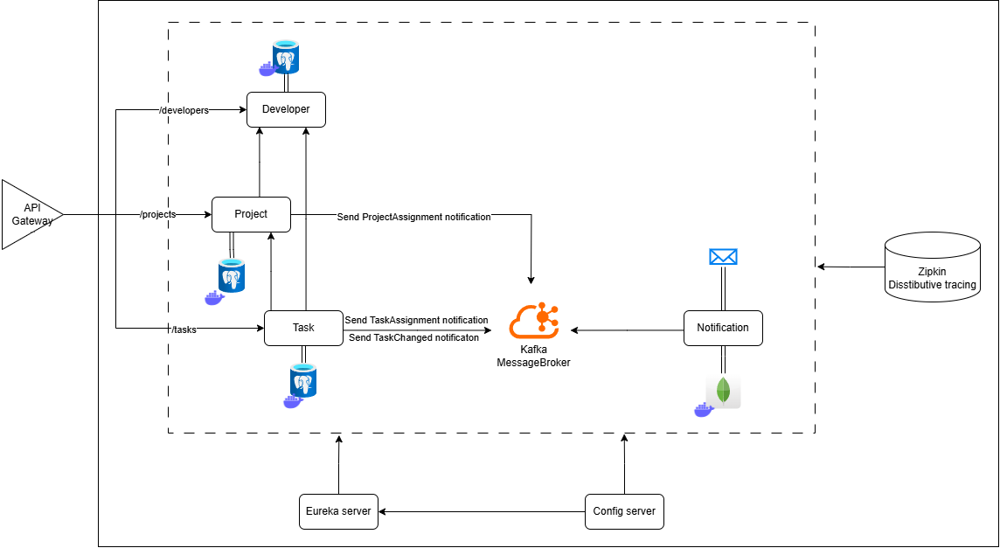

# О проекте



Данное приложение представляет собой систему управления проектами и задачами, разработанная с использованием 
микросервисной архитектуры. Основная цель проекта — автоматизация процессов распределения задач,
уведомлений и отслеживания прогресса в рамках проектов для разработчиков. Данное приложение использует
Zipkin для распределенного трейсинга, а также централизированную точку для входа клиентов.

Уведомления вызываются при назначении/снятии разработчика на/с проекта либо на/с задачи.  

**_Все диаграммы в директории /diagrams_**

# Использование
### Системные инструменты

- MailDev – http://localhost:1080
- Zipkin – http://localhost:9411
- Eureka Server – http://localhost:8761/

### Порт для запросов
Запросы делать по порту – 8222

### Документация запросов микросервисов в Swagger
- Developer – http://localhost:8222/api/v1/developers/swagger-ui.html
- Project – http://localhost:8222/api/v1/projects/swagger-ui.html
- Task – http://localhost:8222/api/v1/tasks/swagger-ui.html

### PostgreSQL
- Порт – 5000
- Логин – admin
- Пароль – admin

### MongoDB
- Порт – 27017
- Логин – admin
- Пароль – admin

# Установка

1. Склонировать проект через git
2. Установить в настойках проекта Java 17
3. В корне проекта ввести комманду (необходимо заранее установить Docker):
```
docker-compose up -d
```
4. В PostgreSQL (смотри порт, логин, пароль выше) создать 3 базы данных:
   * developer
   * project
   * task
5. Запустить микросервисы в следующем порядке:
   * ConfigServer
   * DiscoveryServer
   * Developer
   * Project
   * Task
   * Notification
   * Gateway

### Дополнительно
Остановить docker:
```
docker-compose down
```
# Архитектура

- Java 17
- Spring Boot
- Apache Kafka
- Eureka Server
- Spring Cloud Config
- Zipkin
- PostgreSQL 
- MongoDB 
- Docker
- MailDev