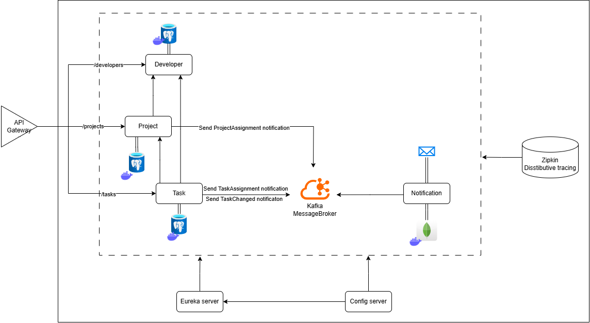

# О проекте



Данное приложение представляет собой систему управления проектами и задачами, разработанная с использованием 
микросервисной архитектуры. Основная цель проекта — автоматизация процессов распределения задач,
уведомлений и отслеживания прогресса в рамках проектов для разработчиков. Данное приложение использует
Zipkin для распределенного трейсинга, а также централизированную точку для входа клиентов.

Уведомления вызываются при назначении/снятии разработчика на/с проекта либо на/с задачи.  

**_Все диаграммы в директории /diagrams_**

# Использование

### Данные администратора по умолчанию
При первом запуске приложения автоматически создаётся учётная запись администратора со следующими данными:

- **Логин:** `admin@admin.com`
- **Временный пароль:** `admin`

При первом запуске необходимо пройти этап активации данной записи с изменением пароля и установкой секретного слова. 

Для этого используются следующие запросы (смотри в Swagger документации):
- POST http://localhost:8222/api/v1/auth/initiate-activation
- POST http://localhost:8222/api/v1/auth/confirm-activation


### Системные инструменты

- MailDev – http://localhost:1080
- Zipkin – http://localhost:9411
- Eureka Server – http://localhost:8761/

### Порт для запросов
Запросы делать по порту – 8222

### Документация запросов микросервисов в Swagger
- Developer – http://localhost:8222/api/v1/developers/swagger-ui.html
- Project – http://localhost:8222/api/v1/projects/swagger-ui.html
- Task – http://localhost:8222/api/v1/tasks/swagger-ui.html
- Auth – http://localhost:8222/api/v1/auth/swagger-ui.html

# Установка для Windows

1. Ввести команду (в проекте bash скрипты, актуально для Windows пользователей)
```sh
git config --global core.autocrlf false
```
2. Склонировать проект через git
3. В .env файле ввести параметры PostgreSQL и MondoDB
4. В корне проекта ввести комманду (необходимо заранее установить Docker):
```sh
docker-compose up -d
```

### Дополнительно
Остановить docker:
```sh
docker-compose down
```

# Установка для Linux

1. Склонировать проект через git
2. В .env файле ввести параметры PostgreSQL и MondoDB
3. В корне проекта ввести комманду (необходимо заранее установить Docker и Docker-compose):
```sh
sudo docker-compose up -d
```

### Дополнительно
Остановить docker:
```sh
sudo docker-compose down
```
# Архитектура

- Java 17
- Spring Boot
- Apache Kafka
- Eureka Server
- Spring Cloud Config
- Zipkin
- PostgreSQL 
- MongoDB 
- Docker
- MailDev